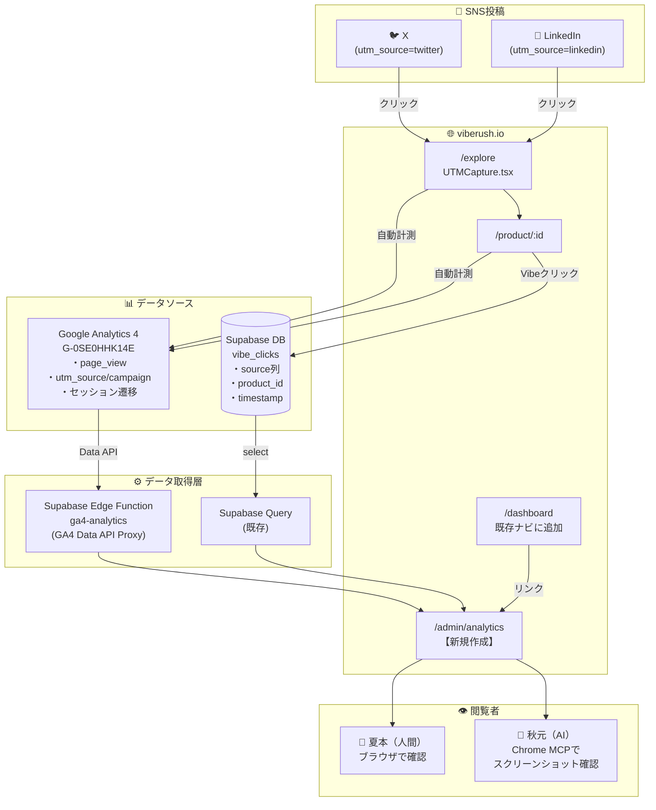
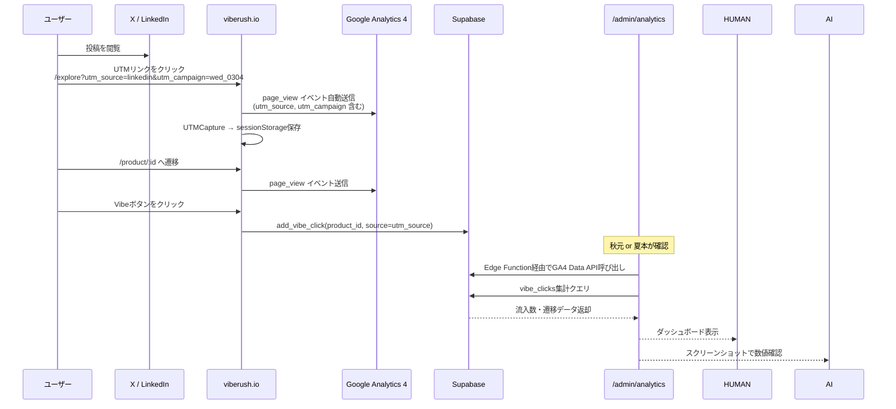

# SNS流入計測・可視化システム 要件定義書

**プロジェクト**: VibeRush SNS Analytics Dashboard
**作成日**: 2026-03-04
**作成者**: 秋元（AI）/ 夏本 健司
**バージョン**: v1.0
**ステータス**: 🔧 実装中（Phase 1）

---

## 1. 目的・背景

### 1.1 目的
X（Twitter）およびLinkedInへのSNS投稿（毎週月曜・水曜）からの流入数と、
着地後のユーザー画面遷移を、人間（夏本）とAI（秋元）の双方が
**簡単に・視覚的に・即座に** 確認できる仕組みを構築する。

### 1.2 背景・現状
| 既存アセット | 状態 | 活用方針 |
|---|---|---|
| GA4（`G-0SE0HHK14E`） | ✅ 設置済み | UTM流入・画面遷移の一次データソース |
| UTMCapture コンポーネント | ✅ 実装済み | SessionStorageへのUTM保存（既存） |
| Supabase `vibe_clicks.source` | ✅ 実装済み | Vibe行動とUTM紐付け（既存） |
| Admin認証（ADMIN_ID） | ✅ 実装済み | 管理ページのアクセス制御に流用 |
| `/dashboard` `/admin/claims` | ✅ 実装済み | ナビゲーション起点として活用 |

### 1.3 計測対象
- **流入元**: X（`utm_source=twitter`）/ LinkedIn（`utm_source=linkedin`）
- **着地ページ**: `/explore`（メインの流入先）
- **遷移先**: `/product/:id`（商品詳細） → Vibe クリック / 外部リンク

---

## 2. システム構成図

### 2.1 全体アーキテクチャ



### 2.2 データフロー詳細



### 2.3 ユーザー遷移ファネル（計測対象フロー）

```mermaid
funnel
    title SNS → VibeRush 行動ファネル
    section SNS
        X / LinkedIn 投稿インプレッション : 10000
    section 流入
        /explore 着地（utm_source確認済み） : 200
    section 回遊
        /product/:id 商品詳細表示 : 80
    section 行動
        Vibeクリック : 30
        外部リンククリック : 20
```

---

## 3. 機能要件

### 3.1 新規作成ページ：`/admin/analytics`

#### 3.1.1 アクセス制御
- `useIsAdmin()` フックで管理者チェック（既存ロジック流用）
- 非管理者は `/auth` にリダイレクト
- `/dashboard` のナビゲーションにリンクを追加

#### 3.1.2 表示内容

**セクション① SNS流入サマリー（本日 / 今週 / 累計）**

| 表示項目 | データソース | 取得方法 |
|---|---|---|
| X 着地数 | GA4 | utm_source=twitter のsessions数 |
| LinkedIn 着地数 | GA4 | utm_source=linkedin のsessions数 |
| 前回比（%） | GA4 | 前週同期間との比較 |
| 期間切り替え | — | 今日 / 今週 / 今月 タブ |

**セクション② 画面遷移ファネル**

| 表示項目 | データソース | 取得方法 |
|---|---|---|
| /explore 着地数 | GA4 | page_view + utm_source フィルタ |
| /product/:id 遷移数 | GA4 | page_view（/product/配下） |
| Vibeクリック数 | Supabase | vibe_clicks.source = 'linkedin' or 'twitter' |
| 外部リンククリック数 | GA4 | click イベント（外部URL） ※将来対応 |

**セクション③ キャンペーン別テーブル**

| 列 | 内容 |
|---|---|
| キャンペーン名 | utm_campaign の値（例: wed_0304） |
| 流入元 | utm_source |
| 着地数 | GA4 sessions |
| 商品詳細遷移率 | % |
| Vibe数 | Supabase vibe_clicks |
| 投稿日 | キャンペーン名から推定 or 手入力 |

**セクション④ リアルタイム（簡易）**
- GA4 リアルタイムAPIは Rate Limit があるため、Supabase vibe_clicks の直近1時間分のみ表示

#### 3.1.3 UI仕様
- デザイン: 既存Tailwind + Shadcn UIコンポーネントを使用（新規CSSなし）
- レスポンシブ: PC優先（管理用途のため）
- 自動更新: 5分ごとにデータ再取得（React Query の `refetchInterval`）
- **秋元が読める設計**: 数値は大きく・明確に表示。グラフより数値テーブルを優先

---

## 4. 技術仕様

### 4.1 GA4 Data API 連携

#### 認証方式
```
GA4 Data API
  → サービスアカウント（JSONキー）
  → Supabase Edge Function（秘匿化）
  → /admin/analytics ページ
```

**理由**: GA4 Data APIキーをフロントエンドに置くとセキュリティリスクがあるため、
Supabase Edge Functionをプロキシとして使用する。

#### Edge Function 仕様
```
関数名: ga4-analytics
エンドポイント: POST /functions/v1/ga4-analytics
認証: Supabase anonkey（既存）
```

**リクエスト例**:
```json
{
  "dateRange": "7daysAgo",
  "dimensions": ["sessionSource", "sessionCampaignName"],
  "metrics": ["sessions", "screenPageViews"]
}
```

**レスポンス例**:
```json
{
  "rows": [
    { "source": "linkedin", "campaign": "wed_0304", "sessions": 87, "pageViews": 134 },
    { "source": "twitter", "campaign": "wed_0304", "sessions": 45, "pageViews": 71 }
  ]
}
```

#### GA4 設定
- **プロパティID**: GA4コンソールで確認（G-0SE0HHK14E の数字部分）
- **サービスアカウント**: Google Cloud Console で発行
- **スコープ**: `https://www.googleapis.com/auth/analytics.readonly`（読み取り専用）

### 4.2 Supabase データ取得

既存の `vibe_clicks` テーブルを利用（追加スキーマなし）：

```sql
-- キャンペーン別Vibeクリック集計
SELECT
  source,
  DATE(created_at) as date,
  COUNT(*) as vibe_count
FROM vibe_clicks
WHERE source IN ('linkedin', 'twitter')
  AND created_at >= NOW() - INTERVAL '30 days'
GROUP BY source, DATE(created_at)
ORDER BY date DESC;
```

### 4.3 新規ファイル構成

```
src/
├── pages/
│   └── AdminAnalytics.tsx        # 新規：メインページ
├── hooks/
│   └── useAnalyticsData.ts       # 新規：GA4 + Supabase データ取得
├── components/
│   └── analytics/
│       ├── FlowSummaryCard.tsx   # 新規：流入サマリーカード
│       ├── FunnelTable.tsx       # 新規：ファネルテーブル
│       └── CampaignTable.tsx     # 新規：キャンペーン別テーブル
supabase/
└── functions/
    └── ga4-analytics/
        └── index.ts              # 新規：Edge Function
```

### 4.4 ルーティング追加（App.tsx）

```tsx
<Route path="/admin/analytics" element={<AdminAnalytics />} />
```

### 4.5 Dashboardナビゲーション追加

`/dashboard` の既存ナビに「📊 SNS Analytics」リンクを追加。

---

## 5. 非機能要件

| 項目 | 要件 |
|---|---|
| **データ更新頻度** | 5分ごと（React Query refetchInterval） |
| **GA4 APIレート制限** | 1日あたり200,000リクエスト（十分） |
| **表示速度** | 初回ロード3秒以内（Edge Function経由） |
| **セキュリティ** | 管理者のみアクセス可（useIsAdmin流用）、GA4キーはEdge Functionで秘匿 |
| **コスト** | GA4 Data API: 無料枠内、Supabase: 既存プラン内 |
| **秋元の利用** | Chrome MCPで `/admin/analytics` を開きスクリーンショット取得・数値報告 |

---

## 6. リスクと回避策

| # | リスク | 影響度 | 発生確率 | 回避策 |
|---|---|---|---|---|
| **R1** | GA4 Data API の設定が複雑で時間がかかる | 高 | 中 | **フェーズ分割**: Phase1はSupabaseデータのみで先行リリース。GA4連携はPhase2 |
| **R2** | サービスアカウントJSONキーの漏洩 | 高 | 低 | Edge Function の環境変数に格納。Gitにcommitしない。`.gitignore`確認 |
| **R3** | UTM命名ルールの揺れ（`twitter` vs `x` vs `X`） | 中 | 高 | **命名規則を今日確定**: X=`twitter`、LinkedIn=`linkedin`（GA4の自動分類に合わせる） |
| **R4** | GA4のデータ反映遅延（最大48時間） | 中 | 高 | リアルタイム性はSupabase vibe_clicksで補完。GA4は集計値として利用 |
| **R5** | Lovableデプロイ時にEdge Functionが別途デプロイ必要 | 中 | 中 | `supabase functions deploy ga4-analytics` を手動実行。デプロイ手順書に記載 |
| **R6** | `/admin/analytics` が検索エンジンにインデックスされる | 低 | 低 | `robots.txt` に `Disallow: /admin/` を追加。データ自体は公開されても問題ない程度に留める |
| **R7** | GA4 Property IDの取得忘れ | 低 | 中 | 実装前に確認チェックリストに記載（GA4コンソール → 管理 → プロパティの詳細） |

---

## 7. 実装フェーズ計画

### Phase 1（本日中）：Supabase のみで先行リリース
**目標**: 管理ページの骨格とSupabaseデータ表示を完成させる

- [ ] `/admin/analytics` ページ新規作成
- [ ] `vibe_clicks` データの取得・表示
- [ ] Dashboard ナビへのリンク追加
- [ ] 期間切り替え（今日 / 今週 / 今月）

**表示できるもの**: Vibe クリック数（UTMソース別）

### Phase 2（今週中）：GA4 Data API 連携
**目標**: 流入数（sessions）をGA4から取得して表示

- [ ] Google Cloud でサービスアカウント作成
- [ ] GA4 Property ID 取得
- [ ] Supabase Edge Function `ga4-analytics` 作成・デプロイ
- [ ] フロントエンドとの接続
- [ ] UTM命名規則の統一確認

**表示できるもの**: X/LinkedIn 着地数、ファネル全体

### Phase 3（次回以降）：自動レポーティング
- [ ] 秋元による週次自動チェック（投稿翌朝にChrome MCPで確認・報告）
- [ ] 外部リンククリックのGA4カスタムイベント追加
- [ ] Looker Studio レポートの埋め込み（オプション）

---

## 8. UTM命名規則（確定版）

今後のSNS投稿リンクに使用するUTMパラメータの統一ルール：

| パラメータ | X（Twitter） | LinkedIn |
|---|---|---|
| `utm_source` | `twitter` | `linkedin` |
| `utm_medium` | `social` | `social` |
| `utm_campaign` | `{曜日}_{MMDD}` 例: `wed_0304` | `{曜日}_{MMDD}` 例: `wed_0304` |

**例**:
```
X:        https://viberush.io/explore?utm_source=twitter&utm_campaign=wed_0304
LinkedIn: https://viberush.io/explore?utm_source=linkedin&utm_campaign=wed_0304
```

---

## 9. 事前確認チェックリスト（実装前に必要な情報）

- [ ] GA4 Property ID（数値10桁）→ GA4コンソール「管理 → プロパティの詳細」
- [ ] Google Cloud プロジェクト（GA4と紐付け済みか確認）
- [ ] Supabase プロジェクトの Edge Functions が有効か確認
- [ ] `robots.txt` の存在確認（`/public/robots.txt`）

---

*本ドキュメントは `/Users/natsuken/_01VibeRush/docs/sns-analytics-spec.md` に保存*
